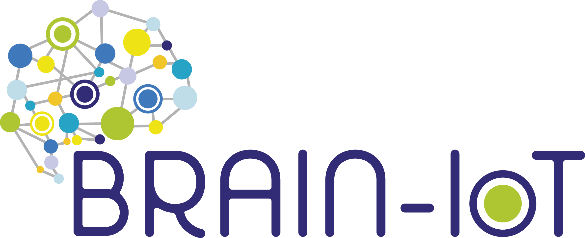

# Brain-IoT Privacy Dashboard

## Introduction

Web-based user interface which serves as interface for the data owners to set the policies associated to their own data. It also serves as an interface for the service providers to set the data access requirements needed to provide the service. The policies defined by Data Owners and Data Consumers through the Privacy Dashboard are stored to the Authorization Server through the BRAIN-IoT PEP (please refer to the related [README](https://github.com/eclipse-researchlabs/brain-iot-privacy-control-system/blob/main/privacy_dashboard/README.md) for more details).

The repository includes also an example folder that contains the application used to test the Privacy Control System, in the use case defined in collaboration with the MONICA EU project. (please refer to the related [README](https://github.com/eclipse-researchlabs/brain-iot-privacy-control-system/blob/main/examples/README.md))

## Installation

### Prerequisites

1. Install [npm](https://www.npmjs.com/get-npm)

2. Install [yarn](https://yarnpkg.com/getting-started/install)

### `npm install -g yarn`

## Available Scripts

In the project directory, you can run:

### `yarn start`

Runs the app in the development mode.\
Open [http://localhost:4000](http://localhost:4000) to view it in the browser.

The page will reload if you make edits.\
You will also see any lint errors in the console.

### `yarn build`

Builds the app for production to the `build` folder.\
It correctly bundles React in production mode and optimizes the build for the best performance.

The build is minified and the filenames include the hashes.\
Your app is ready to be deployed!

See the section about [deployment](https://facebook.github.io/create-react-app/docs/deployment) for more information.

## Configuration

## License
[Eclipse Public License - v 2.0](https://www.eclipse.org/legal/epl-2.0/)
